# Experiment results

Generated by `run_experiment.py`.

## Sharpe ratio by market

|                         |   Simulated seed 0 |   Simulated seed 1 |   Simulated seed 2 |   SPY |   AAPL |   BTC-USD |
|:------------------------|-------------------:|-------------------:|-------------------:|------:|-------:|----------:|
| Buy & Hold              |              -0.94 |              -0.3  |              -0.95 |  0.9  |   0.82 |      0.73 |
| Always Trade            |               2.51 |               1.02 |               1.66 | -0.23 |  -0.36 |     -0.02 |
| Confidence Filter (70%) |               2.48 |               1.15 |               2.06 | -0.44 |  -0.11 |     -0.02 |
| Risk-Aware              |               3.42 |               1.92 |               2.18 | -0.41 |   0.08 |     -0.15 |

## Simulated seed 0

Period: 2019-06-06 to 2026-09-16 (1888 trading days). Costs: 5.0 bps per unit traded.

|                         | Return   | Return / yr   | Risk (vol)   |   Sharpe | Max DD   |   Trades | In market   | Accuracy   | Costs   |
|:------------------------|:---------|:--------------|:-------------|---------:|:---------|---------:|:------------|:-----------|:--------|
| Buy & Hold              | -79.9%   | -19.3%        | 20.4%        |    -0.94 | -84.1%   |        1 | 99.9%       | 46.8%      | 0.1%    |
| Always Trade            | +2065.2% | +50.7%        | 20.2%        |     2.51 | -30.9%   |      262 | 99.9%       | 57.1%      | 26.2%   |
| Confidence Filter (70%) | +1472.1% | +44.4%        | 17.9%        |     2.48 | -29.2%   |      436 | 81.1%       | 58.9%      | 24.2%   |
| Risk-Aware              | +1434.2% | +44.0%        | 12.9%        |     3.42 | -16.0%   |      553 | 92.4%       | 57.8%      | 15.2%   |

Calibration:

| bin          |   stated_confidence |   actual_accuracy |   n_days |
|:-------------|--------------------:|------------------:|---------:|
| (0.499, 0.6] |               0.546 |             0.485 |      198 |
| (0.6, 0.7]   |               0.659 |             0.518 |      193 |
| (0.7, 0.8]   |               0.764 |             0.52  |      221 |
| (0.8, 0.9]   |               0.867 |             0.513 |      300 |
| (0.9, 1.0]   |               0.981 |             0.631 |      975 |

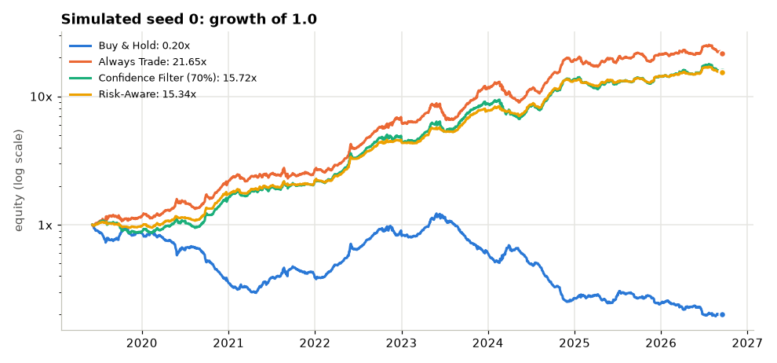
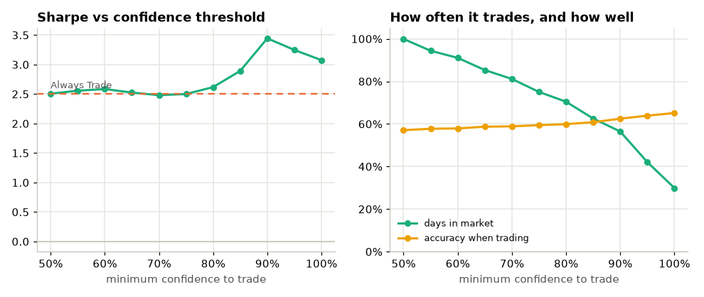
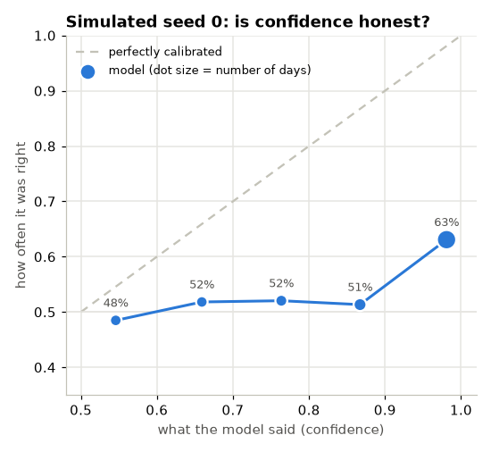

## Simulated seed 1

Period: 2019-06-12 to 2026-09-16 (1895 trading days). Costs: 5.0 bps per unit traded.

|                         | Return   | Return / yr   | Risk (vol)   |   Sharpe | Max DD   |   Trades | In market   | Accuracy   | Costs   |
|:------------------------|:---------|:--------------|:-------------|---------:|:---------|---------:|:------------|:-----------|:--------|
| Buy & Hold              | -42.5%   | -7.1%         | 24.0%        |    -0.3  | -79.8%   |        1 | 99.9%       | 50.4%      | 0.1%    |
| Always Trade            | +421.4%  | +24.6%        | 24.0%        |     1.02 | -43.5%   |      226 | 99.9%       | 55.9%      | 22.6%   |
| Confidence Filter (70%) | +407.9%  | +24.1%        | 20.9%        |     1.15 | -38.2%   |      423 | 79.1%       | 57.0%      | 22.7%   |
| Risk-Aware              | +345.1%  | +22.0%        | 11.4%        |     1.92 | -23.7%   |      542 | 89.0%       | 56.6%      | 13.2%   |

Calibration:

| bin          |   stated_confidence |   actual_accuracy |   n_days |
|:-------------|--------------------:|------------------:|---------:|
| (0.499, 0.6] |               0.552 |             0.506 |      233 |
| (0.6, 0.7]   |               0.659 |             0.517 |      211 |
| (0.7, 0.8]   |               0.763 |             0.557 |      262 |
| (0.8, 0.9]   |               0.866 |             0.536 |      343 |
| (0.9, 1.0]   |               0.976 |             0.594 |      845 |

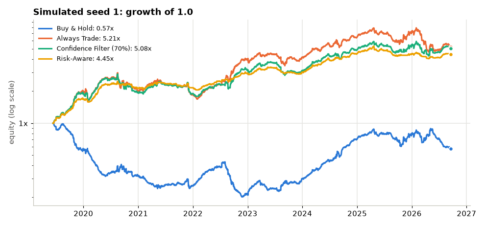
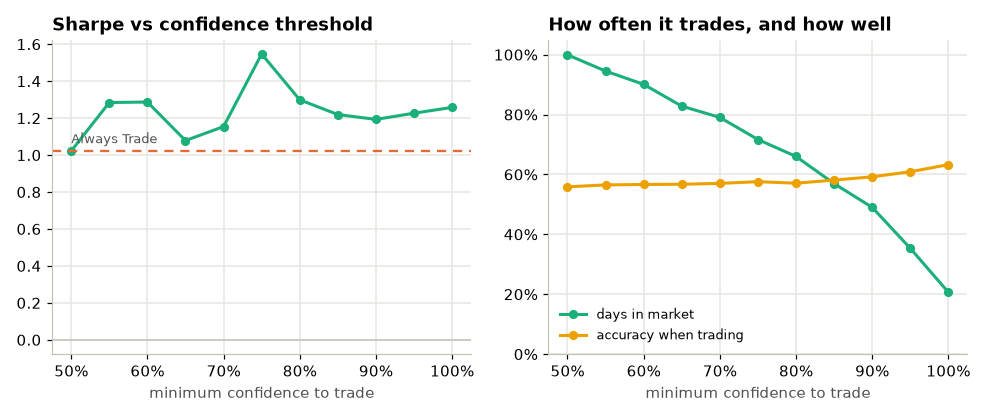

## Simulated seed 2

Period: 2019-06-06 to 2026-09-16 (1897 trading days). Costs: 5.0 bps per unit traded.

|                         | Return   | Return / yr   | Risk (vol)   |   Sharpe | Max DD   |   Trades | In market   | Accuracy   | Costs   |
|:------------------------|:---------|:--------------|:-------------|---------:|:---------|---------:|:------------|:-----------|:--------|
| Buy & Hold              | -84.2%   | -21.7%        | 22.8%        |    -0.95 | -95.2%   |        1 | 99.9%       | 45.6%      | 0.1%    |
| Always Trade            | +1019.6% | +37.8%        | 22.7%        |     1.66 | -34.8%   |      230 | 99.9%       | 55.9%      | 22.9%   |
| Confidence Filter (70%) | +1312.1% | +42.2%        | 20.4%        |     2.06 | -24.3%   |      442 | 79.5%       | 57.1%      | 24.0%   |
| Risk-Aware              | +486.0%  | +26.5%        | 12.1%        |     2.18 | -15.2%   |      546 | 90.9%       | 56.0%      | 13.6%   |

Calibration:

| bin          |   stated_confidence |   actual_accuracy |   n_days |
|:-------------|--------------------:|------------------:|---------:|
| (0.499, 0.6] |               0.553 |             0.52  |      204 |
| (0.6, 0.7]   |               0.664 |             0.485 |      235 |
| (0.7, 0.8]   |               0.766 |             0.54  |      265 |
| (0.8, 0.9]   |               0.857 |             0.539 |      323 |
| (0.9, 1.0]   |               0.976 |             0.602 |      869 |

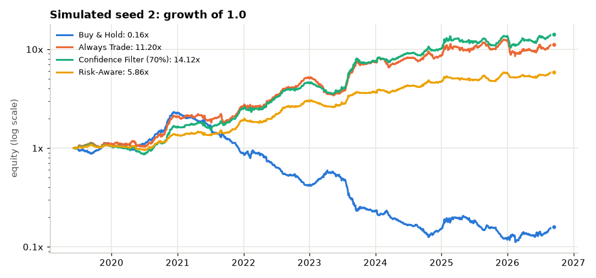
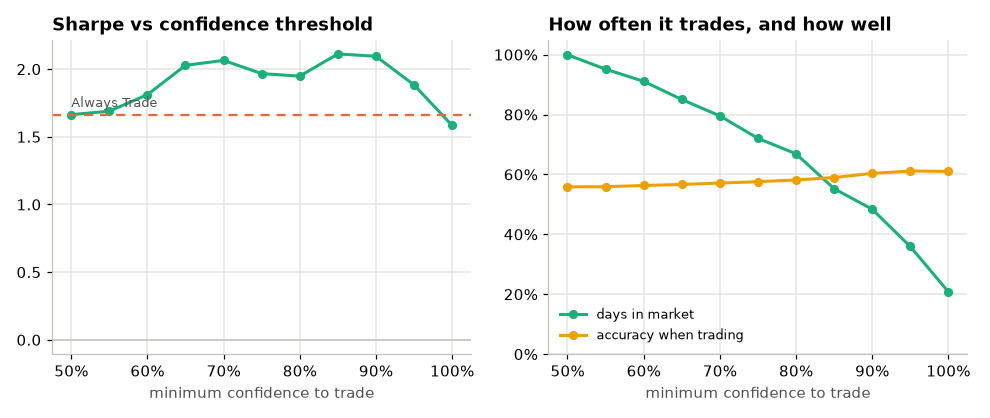
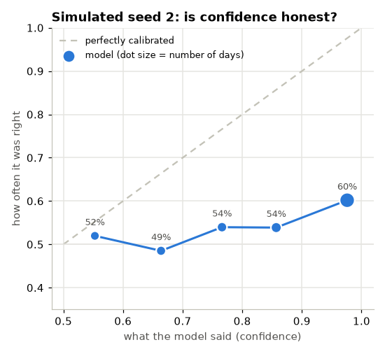

## SPY

Period: 2012-05-21 to 2026-09-15 (3600 trading days). Costs: 5.0 bps per unit traded.

|                         | Return   | Return / yr   | Risk (vol)   |   Sharpe | Max DD   |   Trades | In market   | Accuracy   | Costs   |
|:------------------------|:---------|:--------------|:-------------|---------:|:---------|---------:|:------------|:-----------|:--------|
| Buy & Hold              | +635.1%  | +15.0%        | 16.6%        |     0.9  | -33.7%   |        1 | 100.0%      | 55.2%      | 0.1%    |
| Always Trade            | -42.6%   | -3.8%         | 16.7%        |    -0.23 | -51.6%   |      799 | 100.0%      | 51.0%      | 79.9%   |
| Confidence Filter (70%) | -60.3%   | -6.3%         | 14.2%        |    -0.44 | -64.0%   |     1281 | 67.8%       | 51.0%      | 74.2%   |
| Risk-Aware              | -40.2%   | -3.5%         | 8.5%         |    -0.41 | -44.2%   |     1588 | 86.3%       | 51.3%      | 48.5%   |

Calibration:

| bin          |   stated_confidence |   actual_accuracy |   n_days |
|:-------------|--------------------:|------------------:|---------:|
| (0.499, 0.6] |               0.551 |             0.504 |      694 |
| (0.6, 0.7]   |               0.662 |             0.505 |      596 |
| (0.7, 0.8]   |               0.758 |             0.484 |      639 |
| (0.8, 0.9]   |               0.861 |             0.537 |      713 |
| (0.9, 1.0]   |               0.964 |             0.515 |      957 |

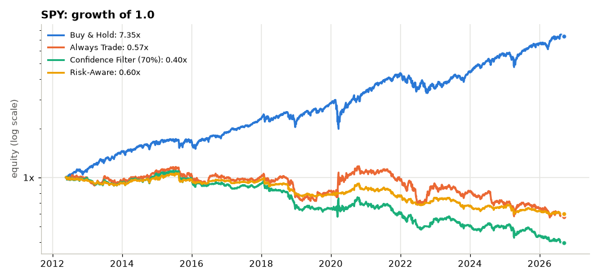
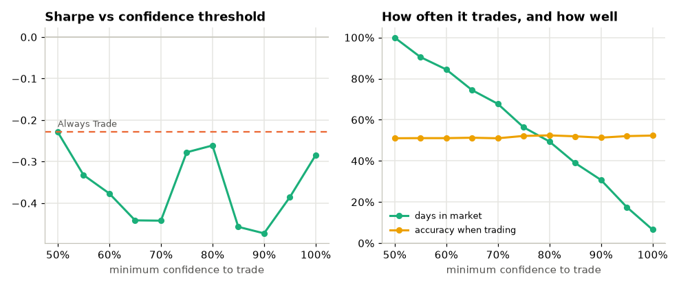
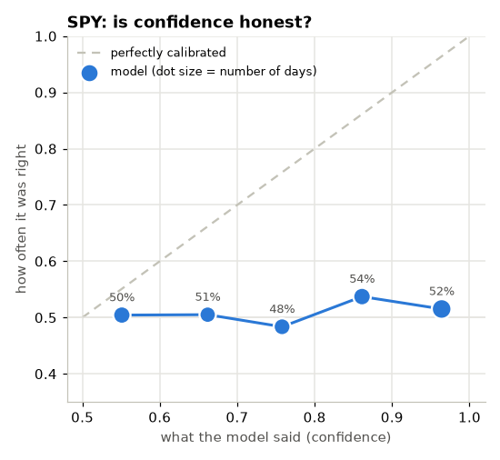

## AAPL

Period: 2012-05-21 to 2026-09-15 (3600 trading days). Costs: 5.0 bps per unit traded.

|                         | Return   | Return / yr   | Risk (vol)   |   Sharpe | Max DD   |   Trades | In market   | Accuracy   | Costs   |
|:------------------------|:---------|:--------------|:-------------|---------:|:---------|---------:|:------------|:-----------|:--------|
| Buy & Hold              | +1872.7% | +23.2%        | 28.2%        |     0.82 | -43.8%   |        1 | 100.0%      | 52.8%      | 0.1%    |
| Always Trade            | -78.7%   | -10.3%        | 28.3%        |    -0.36 | -83.2%   |      647 | 100.0%      | 50.2%      | 64.7%   |
| Confidence Filter (70%) | -29.4%   | -2.4%         | 22.9%        |    -0.11 | -66.7%   |     1103 | 64.9%       | 50.9%      | 61.0%   |
| Risk-Aware              | +12.3%   | +0.8%         | 10.6%        |     0.08 | -33.7%   |     1068 | 78.2%       | 50.8%      | 24.8%   |

Calibration:

| bin          |   stated_confidence |   actual_accuracy |   n_days |
|:-------------|--------------------:|------------------:|---------:|
| (0.499, 0.6] |               0.549 |             0.481 |      717 |
| (0.6, 0.7]   |               0.661 |             0.491 |      684 |
| (0.7, 0.8]   |               0.762 |             0.513 |      675 |
| (0.8, 0.9]   |               0.86  |             0.504 |      665 |
| (0.9, 1.0]   |               0.967 |             0.52  |      858 |

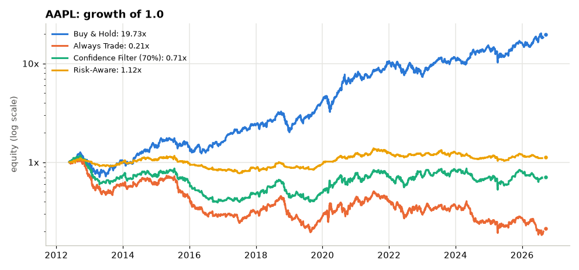
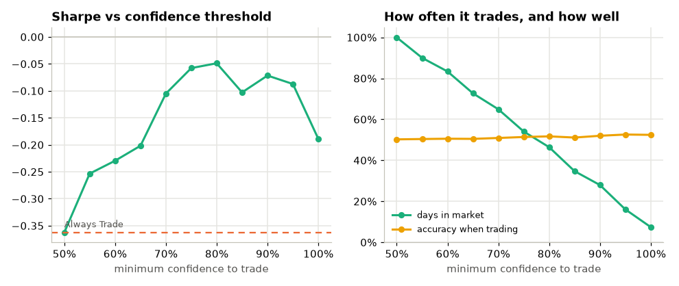
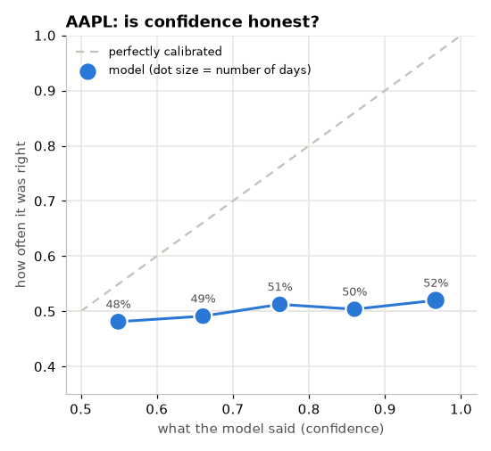

## BTC-USD

Period: 2016-05-09 to 2026-09-16 (3782 trading days). Costs: 5.0 bps per unit traded.

|                         | Return    | Return / yr   | Risk (vol)   |   Sharpe | Max DD   |   Trades | In market   | Accuracy   | Costs   |
|:------------------------|:----------|:--------------|:-------------|---------:|:---------|---------:|:------------|:-----------|:--------|
| Buy & Hold              | +16374.3% | +40.5%        | 55.3%        |     0.73 | -83.4%   |        1 | 100.0%      | 52.3%      | 0.1%    |
| Always Trade            | -15.8%    | -1.1%         | 55.4%        |    -0.02 | -94.3%   |      725 | 100.0%      | 51.8%      | 72.5%   |
| Confidence Filter (70%) | -10.3%    | -0.7%         | 43.4%        |    -0.02 | -91.3%   |     1343 | 62.2%       | 51.8%      | 72.2%   |
| Risk-Aware              | -22.1%    | -1.6%         | 11.0%        |    -0.15 | -51.2%   |      622 | 57.9%       | 50.9%      | 11.4%   |

Calibration:

| bin          |   stated_confidence |   actual_accuracy |   n_days |
|:-------------|--------------------:|------------------:|---------:|
| (0.499, 0.6] |               0.553 |             0.513 |      816 |
| (0.6, 0.7]   |               0.66  |             0.53  |      756 |
| (0.7, 0.8]   |               0.76  |             0.501 |      735 |
| (0.8, 0.9]   |               0.859 |             0.51  |      690 |
| (0.9, 1.0]   |               0.963 |             0.533 |      784 |

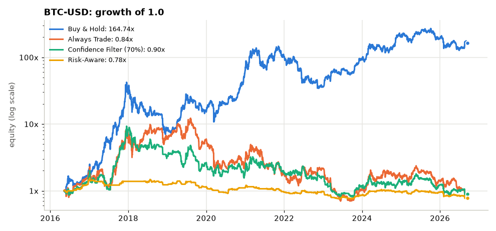
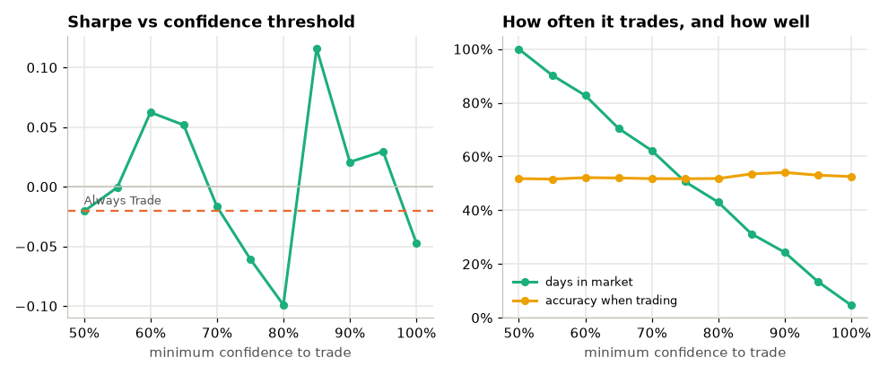
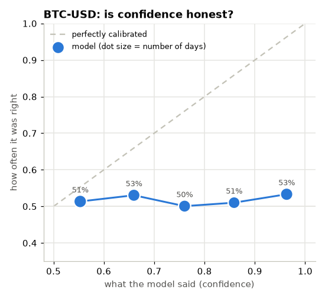
